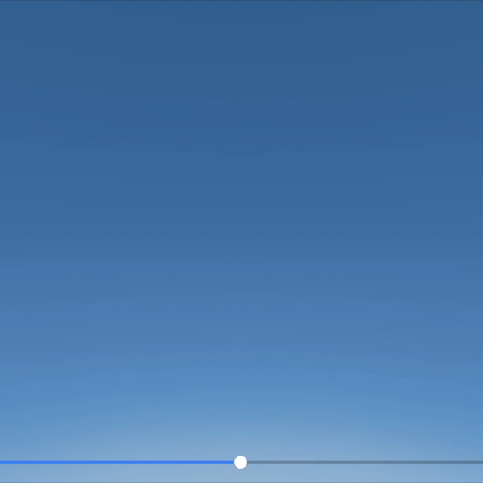

# SCNShadableSky
A demonstration of using `SCNProgram` for custom rendering and animation of a time-of-day dependent skydome

## License

Source code copyright (C) 2018 Warren Moore (MIT License)

Sky texture copyright (C) 2013 Michael Fogleman (MIT License)

Inspired by [Craft](https://github.com/fogleman/Craft)
